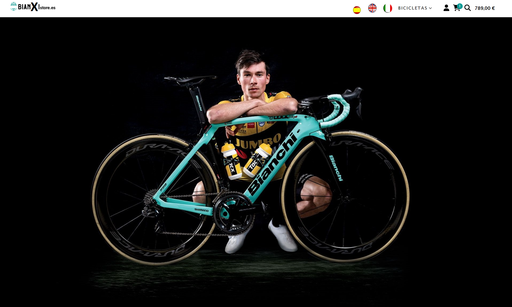
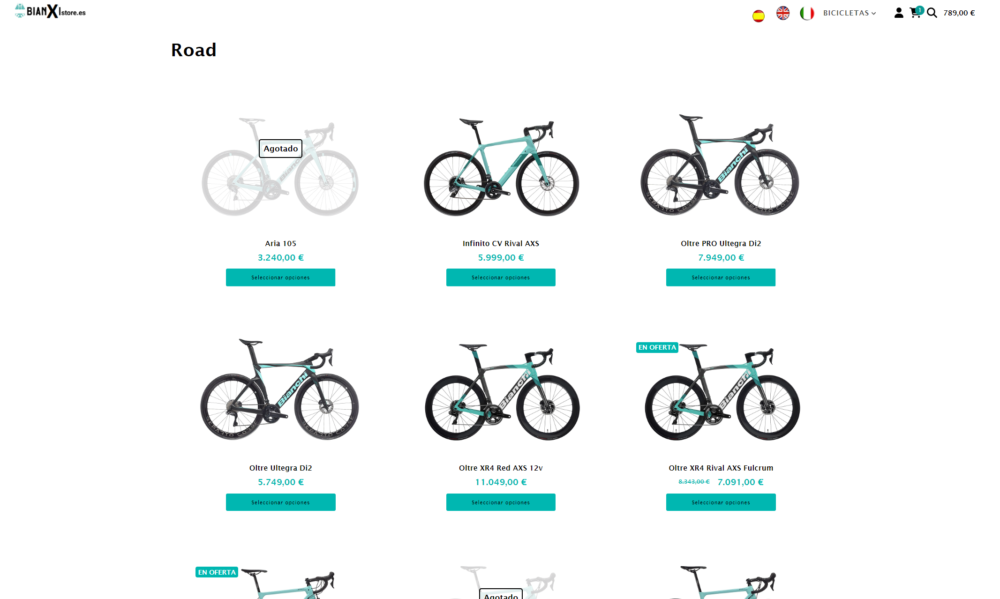
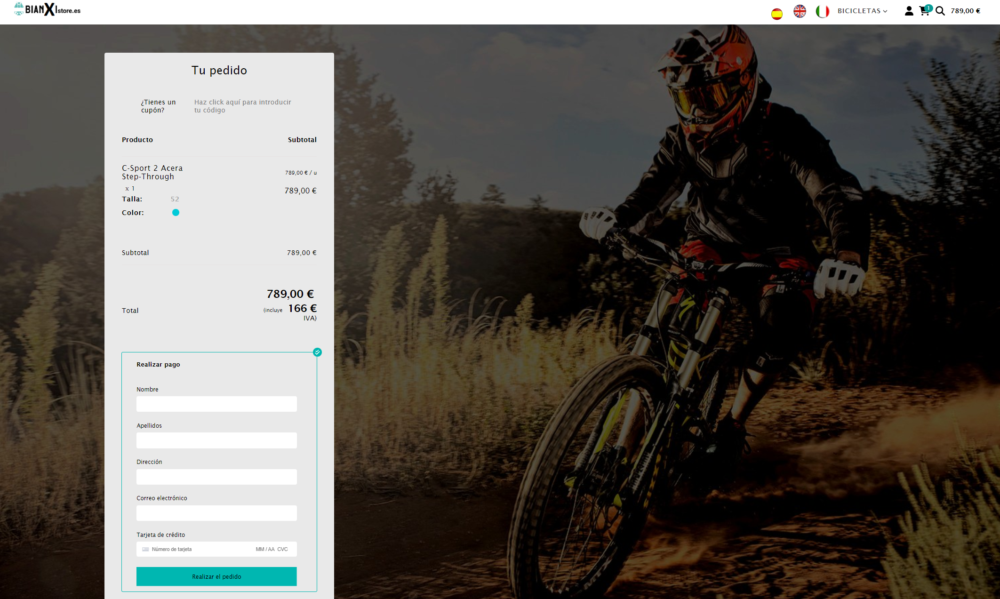

# 🎨 BIANXI FRONT Service

Frontend de la aplicación Bianchi desarrollado con **React 16** empleando `create-react-app`.
 

\
 

## 📝 2.1. Introducción
Interfaz de usuario para el ecommerce Bianchi, conectada directamente a la API de servicios.

## 🛠️ 2.2. Entorno de Desarrollo
Variables de entorno requeridas para el arranque:
- `REACT_APP_API_URL=http://localhost:8080`
- `REACT_APP_STRIPE_VISIBLE_KEY=`
- `REACT_APP_GOOGLE_OAUTH_KEY=`
- `REACT_APP_NEW_USER_DISCOUNT=5`

## 🌿 2.3 Convenciones del Repositorio
- **Ramas:** `feat/`, `refactor/`, `test/`, `chore/`.
- **Commits:** `feat:`, `internal:`, `chore:`.
- **Pull Requests:** Abrir en modo **Draft** para validación de build vía GitHub Actions.

### 📦 2.3.1. Generar Versión
Desde **GitHub Actions -> Release**, ejecutar **Run Workflow** para:
1. Generar nueva versión del proyecto.
2. Subir imagen a Docker Hub.
3. Crear release en GitHub.

## 🐳 2.4. Infrastructura y Despliegue

* **📦 GitOps Repository:** [🚀 `stack/bianxi-front`](https://github.com/devs-toni/Infrastructure-gitops/tree/main/src/web-server/stacks/bianxi)
* **🐳 Docker Hub:** [devstoni/bianxi-front](https://hub.docker.com/repository/docker/devstoni/bianxi-front/general)

<b>This project is based on the page <a href="https://bianchistore.es">Bianchi Store</a> and mocks the e-commerce system implemented by this page, trying with this to improve my knowledge of react and another related libraries.</b>\
